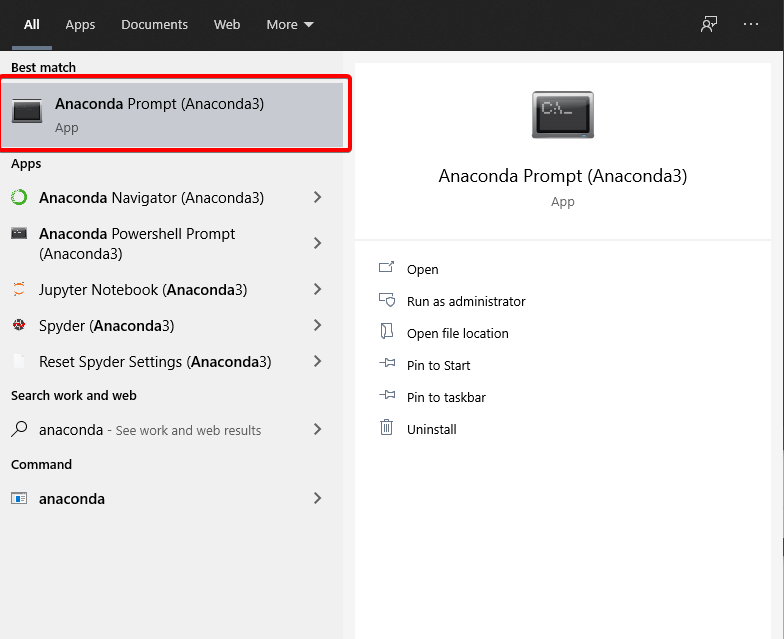
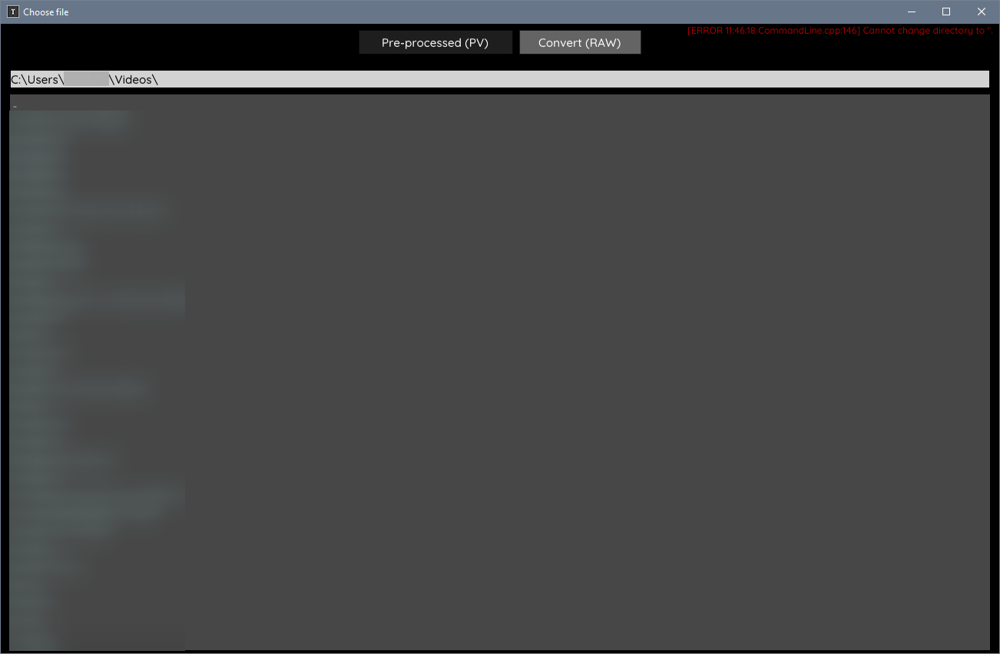
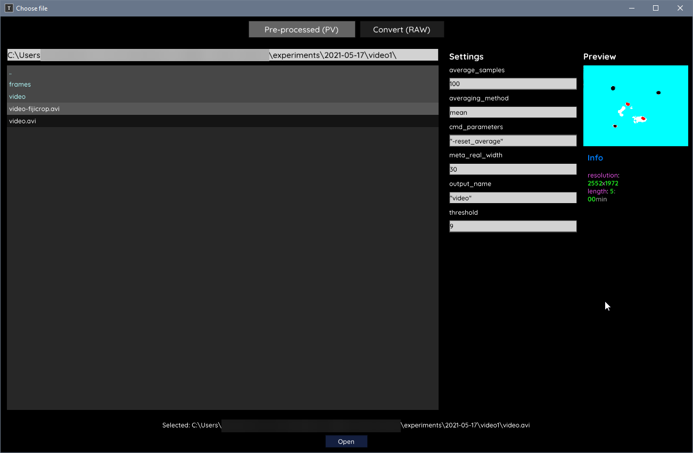

# Using TGrabs and TRex on Windows

## Table of Contents

[TOC]

## Installing TGrabs/TRex

<u>Requirements</u>: *Windows 7/8/10 with Anaconda Individual Edition or higher installed*

First, open the Windows search dialog in the start menu, and search for "Anaconda" in order to find the "Anaconda Prompt". This should open a window that looks similar to the Windows command prompt, and the prompt should begin with "(base)", showing you are in the base Anaconda environment.



Then, in the resulting prompt, enter the following command to set up an environment within Anaconda to use TGrabs and TRex, which should be installed by doing so.

```
conda create -n tracking -c trexing trex
```


Follow the prompts given (it should ask you at some point to hit 'Y' and then ENTER with a 'Y/N' prompt) and it should end with instructions that tell you to use the commands `conda activate tracking` and `conda deactivate` to use the environment. Following these instructions, run the following command to activate the environment.

```
conda activate tracking
```

This should change the `(base)` in your prompt to `(tracking)`, to show that the environment has been properly switched. Then, to test that TRex / TGrabs are properly installed, run the `trex` command in your prompt, and you should see a window that looks like the below image.



If you have no other issues, TGrabs and TRex should be properly installed.

## Using TGrabs/TRex

### Using the Graphical Interface

#### Converting Raw Videos with TGrabs

Before objects can be tracked in a video with TRex, they need to be processed through TGrabs, so that areas of interest can be selected. First, open TGrabs by running the `trex` command in the Anaconda Prompt, then going to the tab marked `Convert (RAW)`. Select a video on your computer by using the folder list and path entry box, then click it to open it with TGrabs.

Then, you should see a screen that looks similar to this, and TGrabs will begin generating the average for your clip on the right side in the preview window. You can change the parameters using the dialog on the right, and when you are ready to process, hit the button on the bottom of the screen marked "Open" to begin processing the video. 



The TGrabs window should close, and the Anaconda Prompt will show the TGrabs command executed. 

#### Tracking Processed Videos with TRex


### Using the Command Line

<u>Note</u>: *This offers more parameters and configuration, but may be more confusing to work with than the graphical representation. It is recommended to start working with the graphical interface, and use the command line when you have specific parameters in mind.*

#### Converting Raw Videos with TGrabs


#### Tracking Processed Videos with TRex


## Potential Problems and Fixes

- If commands starting with "conda" return an error message along the lines of `'conda' is not recognized as an internal or external command, operable program, or batch file.`, Anaconda is either not installed properly, or you may be using the regular Windows Command Prompt rather than the Anaconda Prompt.
- Anaconda provides two prompts, the "Anaconda Prompt", which is based off of the Windows Command Prompt, and the "Anaconda Powershell Prompt", which is based off of Windows Powershell. For using TGrabs and TRex, either should work, but 
- TGrabs has a graphical interface, but that seems to be built into the TRex graphical interface. Running the `tgrabs` command by itself will return a number of errors, and then quit, and this is expected behavior.

## Commonly Used Parameters

### TGrabs


### TRex


## Resources for TGrabs/TRex Documentation

- [TGrabs/TRex Usage Basics](https://trex.run/docs/run.html)
- [TGrabs/TRex Usage Examples](https://trex.run/docs/examples.html)
- [Full List of TGrabs Parameters](https://trex.run/docs/parameters_tgrabs.html)

- [Full List of TRex Parameters](https://trex.run/docs/parameters_trex.html)
- [Example of .settings file](https://github.com/mooch443/trex/blob/master/Application/conversion.settings)

